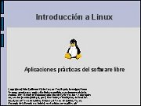
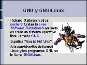
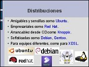

Title: Introducción a GNU/Linux
Slug: gnulinux-introduccion
Summary: Plática introductoria al Software Libre, para explicar sus ventajas, conceptos utilizados y mostrar ejemplos de sus múltiples aplicaciones.
Tags: gnu linux
Date: 2007-04-01 14:00
Modified: 2007-04-01 14:00
Category: presentaciones
Preview: preview.jpg

Plática introductoria al Software Libre, para explicar sus ventajas, conceptos utilizados y mostrar ejemplos de sus múltiples aplicaciones.

### Descargar

* [Presentación](introduccion-linux.pdf)
