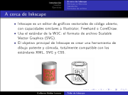
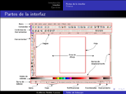
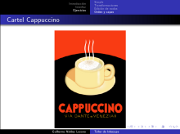

Title: Taller de Inkscape
Slug: inkscape-taller
Summary: Esta es una presentación breve que explica lo que es el dibujo vectorial, las ventajas del Inkscape y muestra los ejercicios hechos.
Tags: software libre
Date: 2007-08-16 22:45
Modified: 2007-08-16 22:45
Category: presentaciones
Preview: preview.jpg

Con motivo del aniversario del [Grupo de Usuarios de GNU/Linux de La Laguna](http://www.gulag.org.mx) participaré con un Taller de [Inkscape](http://www.inkscape.org). Esta es una presentación breve que explica lo que es el dibujo vectorial, las ventajas del Inkscape y muestra los ejercicios hechos.

### Descargar

* [Presentación](inkscape-taller.pdf)
* [Fuentes LaTeX](inkscape-taller-latex.tar.gz)
