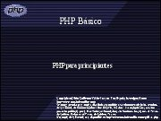
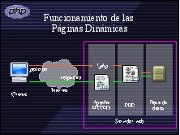
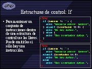

Title: PHP Básico
Slug: php-basico
Summary: La presentación explica los conceptos básicos del PHP, útiles para quienes quieran iniciar el uso de este lenguaje.
Tags: php
Date: 2006-09-01 15:00
Modified: 2006-09-01 15:00
Category: presentaciones
Preview: preview.png

PHP un lenguaje de programación para crear páginas dinámicas. Es libre, puede embeberse en páginas web y se ejecuta en el servidor. La presentación explica los conceptos básicos del PHP, útiles para quienes quieran iniciar el uso de este lenguaje.

### Descargar

* [Presentación](php-basico.pdf)
* [Ejercicios](php-basico-htdocs.tar.gz)
