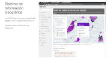

Title: Plataforma del Conocimiento - guía descriptiva
Slug: plataforma-del-conocimiento-guia-descriptiva
Summary: Con motivo de los informes de fin de año y términos de la administración, elaboré esta presentación como una guía descriptiva del proyecto público más importante en el que he colaborado a la fecha, la Plataforma del Conocimiento del IMPLAN Torreón.
Tags: php, markdown
Date: 2017-12-10 10:40
Modified: 2017-12-10 10:40
Category: presentaciones
Preview: preview.jpg

Con motivo de los informes de fin de año y términos de la administración, elaboré esta presentación como una guía descriptiva del proyecto público más importante en el que he colaborado a la fecha, la Plataforma del Conocimiento del IMPLAN Torreón.

### Descargar

* [Presentación Archivo PDF 3.9 MB](plataforma-del-conocimiento-guia-descriptiva.pdf)
