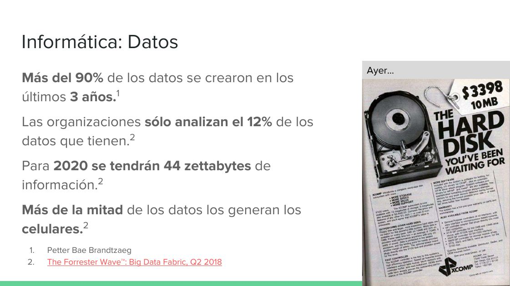
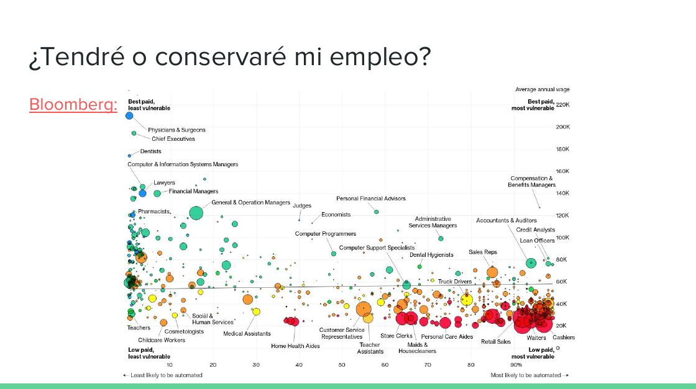

Title: Revolución Tecnológica: De Homo sapiens a tecno-dioses
Slug: revolucion-tecnologica
Summary: En esta ponencia explico los avances tecnológicos más trascendentes de la humanidad y enumero los grandes retos que tenemos que resolver con tecnología, ciencia e ingeniería.
Tags: conferencias, educación
Date: 2019-04-01 18:52
Modified: 2019-04-23 14:48
Category: presentaciones
Preview: preview.jpg
Image: image.jpg

El pasado 1 de abril de 2019, durante la **Semana Académica** de la **Escuela de Sistemas** de la **Universidad Autónoma de Coahuila, Campos Torreón**, tuve el honor de impartir la conferencia **"Revolución Tecnológica: De Homo sapiens a tecno-dioses".**

En esta ponencia explico los avances tecnológicos más trascendentes de la humanidad y enumero los grandes retos que tenemos que resolver con tecnología, ciencia e ingeniería.

### Visualizar en línea

* [Por medio de Google Drive](https://docs.google.com/presentation/d/1npdD3nujxjbYaKmVoY3LPlIb-Emz9DxXppk-GhjuZco/edit?usp=sharing)

### Descargar

* [Archivo PDF 3.5 MB](revolucion-tecnologica-de-homo-sapiens-a-tecno-dioses.pdf)
