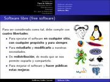
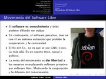
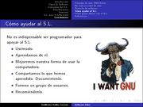

Title: Software Libre
Slug: software-libre
Summary: Presentación que aborda los tipos de software, conceptos como GNU y GPL, distribuciones e imágenes de varios entornos gráficos y algunos ejemplos de software libre.
Tags: gnu linux
Date: 2007-11-28 11:50
Modified: 2007-11-28 11:50
Category: presentaciones
Preview: preview.jpg

Con el fin de extender el contenido de la presentación [Introducción a Linux](introduccion-linux.html) elaboré esta presentación bajo el título **Software Libre** que les servirá para explicar con más detalle los tipos de software, conceptos como GNU y GPL, distribuciones e imágenes de varios entornos gráficos y algunos ejemplos de software libre para la educación.

### Descargar

* [Presentación](software-libre.pdf)
* [Fuentes LaTeX](presentacion-software-libre-fuentes.tar.gz)
