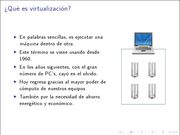
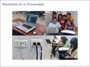

Title: Virtualización con QEmu
Slug: virtualizacion-con-qemu
Summary: Ilustra de forma sencilla cómo se usa el virtualizador QEmu y cómo lo he usado en la impartición de clases de GNU/Linux.
Tags: software libre
Date: 2009-11-28 23:00
Modified: 2009-11-28 23:00
Category: presentaciones
Preview: preview.jpg

Con motivo del [Congreso Iberoamericano FOSS 2009](http://www.estudiosdeldesarrollo.net/foss/) que organiza la [Universidad Autónoma de Zacatecas](http://www.uaz.edu.mx/) he elaborado la conferencia **Virtualización con QEmu**.

En este material se ilustra de forma sencilla cómo se usa el virtualizador QEmu y cómo lo he usado en la impartición de clases de GNU/Linux en la [Universidad Tecnológica de Torreón](http://www.utt.edu.mx/).

### Descargar

* [Presentación 5.5 MB](virtualizacion-con-qemu.pdf)
* [Fuentes LaTeX 5.5 MB](virtualizacion-con-qemu.tar.gz)
