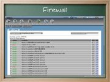

Title: Webmin, administración y configuración desde web
Slug: webmin
Summary: Presentación del Webmin, que es un paquete que permite la administración remota de equipos desde una interfaz web.
Tags: gnu linux
Date: 2007-05-11 09:00
Modified: 2007-05-11 09:00
Category: presentaciones
Preview: preview.jpg

Breve presentación del Webmin, que es un paquete que permite la administración remota de equipos desde una interfaz web.

### Descargar

* [Presentación](webmin.pdf)
